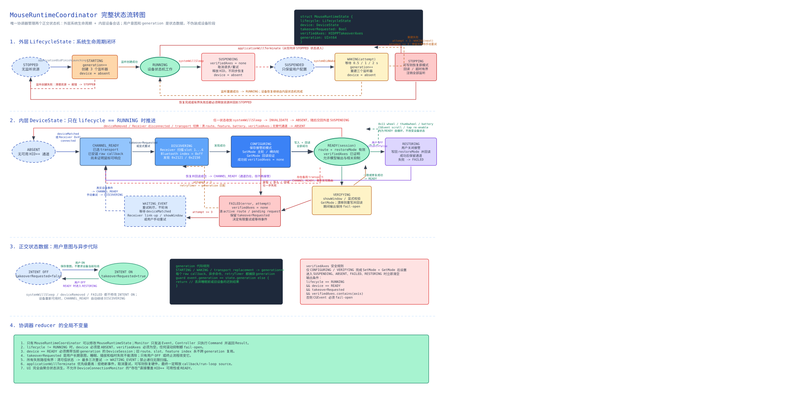
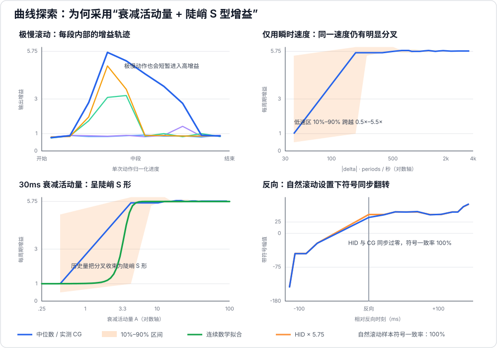
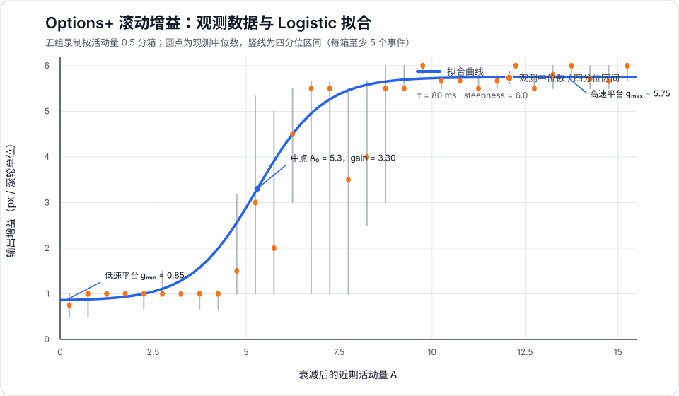

# logi-mouse

这是一个使用 Swift / AppKit 编写的 macOS Logitech 鼠标控制程序。它基于对 Logi Options+ 的黑盒数据分析，通过 USB Receiver 或 Bluetooth HID++ 通道，为主滚轮和横向拇指滚轮提供全局平滑滚动。

当前已完成 MX Master 3 Mac 的两种连接方式、双滚轮接管、自然/标准方向切换、模式校验和退出恢复。滚动体感已通过离线数据和真机体验验证，与 Options+ 无明显差异。SmartShift、DPI、按键和手势不在当前范围内，因此暂时不要卸载 Options+。

## 阅读导航

- 想直接使用：阅读[快速开始](#快速开始)和[运行与权限](#运行与权限)。
- 想了解硬件差异：阅读[USB Receiver 与 Bluetooth 的区别](#usb-receiver-与-bluetooth-的区别)。
- 想了解踩过的坑：阅读[问题复盘](#问题复盘)。
- 想了解睡眠唤醒与设备恢复：阅读[运行时状态机](#运行时状态机)和[完整设计说明](docs/mouse-runtime-coordinator.md)。
- 想了解滚动算法：阅读[曲线分析](#曲线分析)和[离线验证结果](#离线验证结果)。
- 想参与开发：阅读[构建与测试](#构建与测试)和[关键代码](#关键代码)。

## 快速开始

```zsh
./scripts/build-app.sh
open .build/logi-mouse.app
```

首次运行需要在“系统设置 → 隐私与安全性”中开启“输入监控”和“辅助功能”，然后完全退出并重新打开应用。在主界面确认连接方式后，打开“平滑滚动”即可；关闭开关或按 `Command-Q` 会恢复鼠标的原生滚动模式。

## 当前能力与边界

- 动态发现 HID++ Root Feature，以及主滚轮 `0x2121`、横向轮 `0x2150`。
- 分别启用两个滚轮的 Diverted 模式，写后回读校验，并在关闭或退出时恢复原设置。
- 两个轴使用同一条连续 Logistic 增益曲线，但独立保存活动量和小数余量。
- 支持自然滚动和标准滚动；方向只在输出端转换，不改变幅度曲线。
- USB Receiver 使用槽位 `1...6`；Bluetooth 使用直连索引 `0xff`。切换传输时会清除旧路由并重新发现 feature index。
- 主应用不再包含数据采集和分析界面；历史工具位于 `Diagnostics/LegacyCapture/`，不参与产品编译。

## 运行时状态机

`MouseRuntimeCoordinator` 是应用内唯一的运行时状态所有者。系统睡眠/唤醒、设备插拔、用户开关、HID++ 命令结果和恢复定时器都先转换成事件，再由纯 reducer 计算新状态和待执行副作用。



图中需要区分三类信息：

- `lifecycle` 表示监听资源处于启动、运行、睡眠、唤醒还是停止阶段。
- `device` 表示当前 HID++ 会话处于缺失、发现、配置、校验或就绪阶段。
- `takeoverRequested` 是跨睡眠和断连保留的用户意图；`verifiedAxes` 是当前硬件会话的校验事实，失去硬件可信度时立即清空。

每次启动、睡眠、唤醒或停止都会递增 `generation`。旧 generation 的设备回调、命令结果和重试任务全部丢弃，防止睡眠前的 IOHID 对象在唤醒后重新污染状态。只有运行时为 `running`、设备为 `ready` 且对应滚轮轴已经写后回读验证，应用才会抑制原生滚动并注入模型输出。

睡眠到唤醒的逐事件流程见[系统睡眠唤醒细化图](docs/system-sleep-wake-flow.svg)，状态定义、四层职责和失败恢复策略见[完整设计说明](docs/mouse-runtime-coordinator.md)。

## USB Receiver 与 Bluetooth 的区别

两种连接最终复用相同的 HID++ 解码和滚动算法，但 macOS 暴露给应用的设备拓扑不同：

| 项目 | USB Receiver | Bluetooth Low Energy |
| --- | --- | --- |
| HID 拓扑 | HID++ 是独立的 `0xff00/1` interface | 键盘、指针和 `0xff43/0x0202` HID++ 位于同一个复合 interface |
| HID++ 路由 | Receiver 槽位 `1...6` | 直连设备索引 `0xff` |
| 滚轮报告 | 通常是单周期报告 | 可能把多个采样合并在 `periods` 中 |
| 指针事件 | 选中的 HID++ interface 不接收指针报告 | 同一 raw callback 会收到 `0x02` 指针和 `0x11` HID++ 报告 |
| CPU 表现 | 移动指针不会唤醒 logi-mouse | 系统会先唤醒回调；C bridge 在进入 Swift 前丢弃 `0x02`，只能降低成本，不能消除底层唤醒 |
| 连接事件 | Receiver 保持插入；通过 `0x10/0x41` 通知判断配对设备上线/离线 | 通过 `IOHIDInterface` 到达和终止判断连接 |
| 重连方式 | 收到 Receiver 连接通知后恢复一次 | Bluetooth interface 重新出现后恢复一次 |

Bluetooth 慢速滚动曾因 parsed-element `IOHIDQueue` 合并和调度时序出现停顿。最终两种传输都改用保留原始边界和时间戳的 raw-report callback，并按 `periods` 展开，因此超慢和快速滚动已经使用同一条数据路径。Bluetooth 的复合接口决定了指针移动仍会唤醒进程；评估过 HIDDriverKit，但它同样需要接管整个复合 interface，还会引入系统驱动竞争和发布 entitlement，当前不采用。

## 问题复盘

下面只保留对后续维护有价值的问题、根因和最终处理方式：

| 问题 | 根因 | 处理与结论 |
| --- | --- | --- |
| 采集入口启动后没有数据 | 输入监控授权属于具体 App，Codex/终端子进程不会自动继承 | 使用独立签名 App 采集；启动后先确认文件和采集窗口，再开始动作 |
| 同时存在多个旧实例 | 调试阶段重复启动 App，旧进程仍持有 HID/事件监听 | 重启前退出旧实例；产品只保留单 App、单进程架构 |
| Options+ 退出后仍影响滚动 | UI 退出不代表 `com.logi.cp-dev-mgr` Agent 停止 | 单独管理 Agent；验证时明确记录 Options+ Agent 和权限状态 |
| 停掉 Options+ 后滚动行为突变 | Agent 同时维护 MagSpeed/设备模式，不只是生成滚动曲线 | 先完成 HID++ 主动接管和原生恢复，再停用 Agent，不能把“停 Agent”当作天然干净基线 |
| 工程名称和主界面仍像调试工具 | 早期代码沿用旧调试名称和采集测试界面 | 统一命名为 `logi-mouse`，建立产品设置界面，采集代码移入 `Diagnostics/LegacyCapture/` |
| 是否需要独立后台 Agent | UI 和滚动服务拆进程会产生接管所有权、IPC 和异常恢复问题 | 当前保持单 App、单进程；只有未来要求 UI 退出后服务继续运行时再拆分 |
| 是否启用 App Sandbox | 全局 HID、输入监听和 CGEvent 注入需要系统级能力和隐私授权 | 当前应用不启用 App Sandbox，仍要求用户显式授予输入监控和辅助功能权限 |
| 录制场景数据不足或动作错误 | 窗口过短、滚到底、动作混入或场景名称与无级滚轮不一致 | 放大可滚动范围；每组独立录制；错误操作废弃，以最后一次有效操作为准 |
| 状态机难以同时拟合慢速、快速和反向 | 输出增益具有连续平台和历史依赖，不是几个速度挡位 | 使用“指数衰减活动量 + Logistic S 曲线 + 误差扩散”，状态只保留方向和连续量 |
| 超慢滚动偶尔丢失 | 低速增益产生小于 1 px 的结果，整数 CGEvent 直接舍入为零 | 保存小数余量并误差扩散；孤立最小单位至少注入 `1 px` |
| 自然滚动方向容易重复反转 | 设备、macOS 和应用都可能处理方向 | 幅度模型与方向解耦，只在最终输出应用自然/标准方向乘数，主滚轮和横向轮一致 |
| 横向滚轮失效或不跟手 | 初期只接管 `0x2121`，横向轮仍走不同的系统路径 | 增加 `0x2150` 动态发现和 Diverted 模式；复用主滚轮算法但使用独立轴状态 |
| 测试区可能混入 Options+ 输出 | 模型输出与 Options+ 原始事件同时存在 | 使用同轴、时间窗口和 period 配额抑制原始事件；注入事件加 marker 防止反馈环 |
| `Command-Q` 不能退出或退出后滚轮异常 | 退出路径没有先同步恢复硬件模式 | 标准菜单和终止流程统一执行同步恢复，再结束进程 |
| 静止时 CPU 仍约 `0.5%` | 高频队列、固定轮询和调试链路持续唤醒 | 下线采集入口，改 raw-report callback；模式校验改为窗口显示或设备连接事件触发 |
| 蓝牙快速滚动慢且卡顿 | Bluetooth 报告可能批量携带多个 `periods`，旧路径丢失时序 | 使用 raw report 并逐 period 展开，现与 USB 使用同一模型 |
| 蓝牙超慢滚动“停一下、滚一下” | parsed-element queue 不保留原始报告边界，Run Loop 调度放大低速间隔 | 放弃 IOHIDQueue，USB/Bluetooth 统一使用 raw-report callback |
| 蓝牙移动指针时 CPU 高于 USB | Bluetooth 把指针 `0x02` 和 HID++ `0x11` 放在同一复合 interface | C 层在 Swift 前过滤指针报告；这是 Apple HID 拓扑带来的剩余差异 |
| 报错 `No HID++ device responded...` | 传输切换后仍使用旧槽位/feature，或 Bluetooth 匹配方式不正确 | 切换时清理路由；Receiver 重新扫描槽位，Bluetooth 使用 `0xff` 并重新发现 feature |
| 鼠标断开后主界面仍显示连接 | 只根据泛化设备或已插入 Receiver 判断，未跟踪真实接口和链路 | Bluetooth 跟踪 `IOHIDInterface` 生命周期；Receiver 解析 `0x10/0x41` 链路通知 |
| 鼠标断开后不断重试扫描 | 接管意图保留后，失败路径每 `0.35 s` 递归重试 | 改为事件驱动；一次事件只恢复一次，失败后等待下一次设备连接事件或窗口重新显示 |
| 系统唤醒后无法恢复监听 | 睡眠前的 IOHID 对象、回调和 HID++ 路由在唤醒后已不可信，原实现没有统一重建运行时资源 | 使用单一运行时协调器；睡眠时无写入挂起，唤醒后按新 generation 重建监听、有限重试并重新校验接管模式 |

## 数据链路

开启平滑滚动后：

```text
USB Receiver slots 1...6 ─┐
                          ├→ Root Feature ─┬→ 0x2121 主滚轮 → Diverted + High Resolution ─┐
Bluetooth direct 0xff ────┘                └→ 0x2150 横向轮 → Diverted ───────────────────┤
                                                                                         ↓
                                         独立轴状态 → ScrollDynamicsModel → CGScrollInjector
```

两个轴共享同一组衰减和 S 形增益参数，但不会共享滚动历史，避免快速纵向滚动意外抬高横向增益。`0x2150` 的事件格式与模式控制依据 [OpenLogi thumbwheel 参考](https://openlogi.org/en/hidpp/features/x2150-thumbwheel)。应用注入的事件带有专用 marker，事件监听器会识别并放行，避免反馈环。

## 曲线分析

### 有效录制场景

历史拟合使用的 Options+ 黑盒录制如下；这些文件不再由当前主应用生成：

```text
~/Library/Application Support/logi-mouse/captures/
```

| 场景 | 文件 | 目的 |
| --- | --- | --- |
| 慢速、自然停止、向下 | `20260803-064557-options-on-free-spin-slow-natural-stop-down.jsonl` | 观察低速平台和自然衰减 |
| 快速、自然停止、向下 | `20260803-064735-options-on-free-spin-fast-natural-stop-down.jsonl` | 观察高速平台和长尾 |
| 快速、硬停止、向下 | `20260803-065011-options-on-free-spin-fast-hard-stop-down.jsonl` | 区分软件惯性与硬件输入停止 |
| 向下后反向向上 | `20260803-065149-options-on-reverse-down-up.jsonl` | 验证方向切换和历史状态 |
| 超慢、微小幅度、向下 | `20260803-065515-options-on-free-spin-ultra-slow-controlled-down.jsonl` | 验证代码阅读式精细滚动 |

### 曲线形状

采集数据表现出两个明显平台：

- 低活动量时，单个滚轮单位约映射为 `0.85–1.0 px`，适合缓慢阅读和微调。
- 高活动量时，增益迅速上升并稳定在约 `5.75 px`，适合自由滚轮快速浏览。
- 两个平台之间是较陡的连续 S 形过渡，而不是几个离散挡位。
- 一次完整操作中看到的 `1.42`、`2.0`、`3.0` 等平均增益，主要是低平台和高平台事件混合后的统计结果，并不代表必须增加对应的状态。

只使用当前瞬时速度无法解释相同输入在加速段和减速段的不同输出，数据具有明显历史依赖。因此模型使用一个随时间指数衰减的“近期活动量” `A`。

#### 原始探索性曲线



这张图保留了算法选择阶段的四组关键证据：极慢动作内部仍会出现增益爬升；只用瞬时速度时同一速度存在明显分叉；加入衰减历史量后数据收束为陡峭 S 形；反向时 HID 与 CG 的符号同步翻转。图中的 `30 ms` 是探索阶段用于识别曲线形状的窗口，最终经过五场景联合回放后将时间常数定为 `80 ms`。

#### 最终参数曲线



图中的观测点来自五组有效录制：按衰减后的活动量以 `0.5` 为宽度分箱，每个圆点表示该箱的观测增益中位数，竖线表示 25%–75% 四分位区间。它直观显示了约 `0.85` 的低速平台、`A ≈ 5.3` 附近的快速过渡，以及约 `5.75` 的高速平台；过渡区的离散也说明只依靠单次瞬时输入无法稳定拟合，需要保留近期活动量。

### 数学模型

对第 `i` 个 HID++ 输入，先将之前的活动量按时间衰减：

```text
A_before(i) = exp(-Δt / τ) × A(i-1)
```

然后通过 Logistic 曲线计算增益：

```text
gain(A) = gain_min
        + (gain_max - gain_min)
        / (1 + exp(-steepness × (A / activity_midpoint - 1)))
```

当前输入的每个 period 都使用更新前的 `A_before` 计算输出：

```text
output_per_period = delta × direction_multiplier × gain(A_before)
A(i)              = A_before + abs(delta) × periods
```

最终拟合参数：

| 参数 | 数值 | 含义 |
| --- | ---: | --- |
| `decayTimeConstant` | `0.080 s` | 近期活动量的衰减时间常数 |
| `minimumGain` | `0.85` | 超慢滚动的低速平台 |
| `maximumGain` | `5.75` | 快速自由滚动的高速平台 |
| `activityMidpoint` | `5.3` | S 曲线的中点活动量 |
| `steepness` | `6.0` | 低、高平台之间的过渡陡峭度 |

该曲线在 `A = 0` 附近约为 `0.86`，在 `A = 5.3` 时为 `3.30`，随后快速趋近 `5.75`。因此超慢滚动能保持精确，连续输入又能很快进入高速区。

### `periods` 与量化

HID++ `0x2121` 报告 flags 的低 4 位表示 `periods`：

```text
periods = max(1, flags & 0x0f)
```

例如 `0x11` 表示 1 个 period，`0x12` 表示 2 个 periods。Options+ 会按 period 展开输出，模型也会生成对应数量的事件；这也是 Live 验证中 CGEvent 数量可能多于 HID++ 报告数量的原因。

CGEvent 面向所有应用都可靠的 point delta 是整数位移。若每次直接四舍五入，超慢滚动会不断丢失小数并产生明显误差。因此模型保存小数余量，使用误差扩散把它累积到后续事件；方向反转时清除小数余量，但保留连续活动量。运行时还对实际注入增益应用 `1.0` 下限，确保孤立的单单位硬件输入至少产生 `1 px`，不会因拟合曲线的 `0.85` 低速平台而被量化为零；这只影响最低速量化区，不改变活动量曲线和高速平台。

### 自然滚动、停止与反向

- 本轮样本开启了 macOS 自然滚动，录制中 HID++ 与 CGEvent 的方向符号一致率为 `100%`。
- 自然滚动和传统滚动共享同一条幅度曲线，只在最终输出阶段应用 `+1` 或 `-1` 的方向乘数。
- 快速自然停止时的长尾来自仍在到达的硬件滚轮报告，不需要额外的软件惯性定时器。
- 快速硬停止时，HID++ 报告停止后模型也立即停止输出。
- 方向反转不会把速度模型切换成另一个状态，只清理跨方向不应继承的量化余数。

## 离线验证结果

最终参数对五组原始 Options+ 录制进行逐事件回放，结果如下：

| 场景 | Options+ 总位移 | 模型总位移 | 总距离误差 | 方向一致率 |
| --- | ---: | ---: | ---: | ---: |
| 慢速自然停止 | 9,081 | 9,248 | 1.8390% | 100% |
| 快速自然停止 | 153,333 | 153,095 | 0.1552% | 100% |
| 快速硬停止 | 50,505 | 50,624 | 0.2356% | 100% |
| 向下后反向向上 | 178,295 | 178,300 | 0.0028% | 100% |
| 超慢精细滚动 | 1,106 | 1,117 | 0.9946% | 100% |

所有场景的总距离误差都低于 2%。模型在超慢滚动、快速滚动、自然停止、硬停止和反向操作之间使用同一组参数，没有为单独场景增加特判状态。

## Live 闭环验证

第一组正式闭环录制：

```text
20260803-080931-options-on-observation.jsonl
```

| 层级 | 事件数 | 位移和 |
| --- | ---: | ---: |
| HID++ 输入 | 70 | — |
| `model_output` | 70 | -250 |
| 应用注入的 `cg_event` | 70 | -250 |
| 窗口收到的 `ns_event` | 70 | -250 |
| 被抑制的 Options+ 原始事件 | 70 | 不进入页面 |

离线分析器重新回放该文件后，观测位移与预测位移均为 `250`，总距离误差和逐事件误差均为 `0`，方向一致率为 `100%`。页面 offset 记录为 `249`，属于视图 frame 采样时机造成的 1 px 差异，不是注入链路丢事件。

第二组长时间主观体验录制：

```text
20260803-083653-options-on-observation.jsonl
```

- 模型生成 2,753 条逻辑输出；按 `periods` 展开后注入 2,820 条 CGEvent。
- 模型总位移与应用注入总位移均为 `-68,397`，完全一致。
- 同期 Options+ 生成的 2,820 条原始事件全部在测试区域内被抑制。
- 在模型输出附近 2 ms 内，没有 Options+ 事件绕过抑制进入页面。
- 实际体验反馈为滚动正常，手感与 Options+ 无明显差异。

这证明测试区域内的最终页面滚动来自当前模型，而不是模型输出与 Options+ 输出叠加后的结果。Options+ 当前仍负责设备侧状态维护，但它自己的滚动曲线不会影响测试区域内的体验结果。

### Receiver 主动接管验证

在 Options+ Agent 停止状态下完成了以下真机闭环：

- 曾验证 Agent 退出会把设备从 Diverted `0x03` 改回原生 `0x02`，重新写入并回读 `0x03` 可以恢复。当前不做周期守护，窗口重新显示或设备重连时才校验。
- Agent 停止后，HID++ `0x2121` 输入、模型输出和应用注入持续工作，测试区滚动体验正常，外部 Options+ 事件为零。
- 取消接管时，应用写入并回读 `0x02`，原生系统滚动正常。
- 接管状态下按 `Command-Q`，应用在退出前写入并回读 `0x02`；进程退出后、Options+ Agent 未参与时，原生滚动正常。
- Receiver 拔插后无需切换开关即可自动重建接管；优化后的控制接口出现到完整接管约 `1.01 s`，主观约 `0.5 s` 开始恢复。
- 睡眠期间 HID++ 请求按预期超时；唤醒后检测到默认 `0x00` 并自动恢复 `0x03`，主观约 `1 s` 恢复。
- 全局模式下，Options+ 运行时模型输出 `-2994 px`，应用注入也为 `-2994 px`；Options+ Agent 的 1,726 条原始事件全部被抑制。
- 停止 Options+ Agent 后，浏览器、编辑器等其他应用中的独立全局滚动体验正常。

## 构建与测试

需要 macOS 和 Xcode。构建应用：

```bash
./scripts/build-app.sh
```

运行测试：

```bash
DEVELOPER_DIR=/Applications/Xcode.app/Contents/Developer \
CLANG_MODULE_CACHE_PATH="$PWD/.build/module-cache" \
SWIFTPM_MODULECACHE_OVERRIDE="$PWD/.build/module-cache" \
/usr/bin/xcrun swift test --disable-sandbox
```

应用产物：

```text
.build/logi-mouse.app
```

当前产品测试集包含曲线计算、衰减、低速量化下限、误差扩散、方向反转、Bluetooth 批量 periods 与 USB 单周期等价性、连接方式识别、Bluetooth 直连路由、C 层报告过滤、Receiver 连接通知、分轴接管安全门、滚动事件关联和按需校验限频，以及主滚轮/横向轮请求构造、事件解码、响应匹配、动态 feature、模式位解析和原生恢复等 30 项测试。

当前机器的 `xcode-select` 指向 Command Line Tools，而其 SDK 与系统 Swift 小版本不匹配。因此构建脚本和上面的测试命令都显式使用 `/Applications/Xcode.app` 工具链，无需修改全局 `xcode-select`。

### 正式发布

`build-app.sh` 使用 ad-hoc 签名，只适合本机调试。正式分发必须使用统一发布脚本；它会拒绝脏工作区，执行 Developer ID Application 与 Hardened Runtime 签名、Apple notarization、票据装订和最终校验，并生成带 commit 与 SHA-256 的发布清单：

0.1.0 的用户可见变更、系统要求和已知限制见 [`docs/release-notes-0.1.0.md`](docs/release-notes-0.1.0.md)。

```zsh
export LOGI_MOUSE_DEVELOPER_ID_APPLICATION='Developer ID Application: Example (TEAMID)'
export LOGI_MOUSE_NOTARY_PROFILE='logi-mouse-notary'
./scripts/release-app.sh
```

`LOGI_MOUSE_NOTARY_PROFILE` 需要预先通过 `xcrun notarytool store-credentials` 保存到登录钥匙串。正式产物为 `.build/logi-mouse-notarized.zip`，不要分发 ad-hoc 调试包。

## 运行与权限

1. 构建并打开 `.build/logi-mouse.app`。
2. 在“系统设置 → 隐私与安全性 → 输入监控”中允许应用读取 HID 输入。
3. 若要使用平滑滚动，同时在“辅助功能”中允许应用监听和注入事件。
4. 修改权限后完全退出并重新打开应用。
5. 主界面会显示当前设备连接方式；USB Receiver 与受支持的 MX Master Bluetooth 连接都可以开启平滑滚动。
6. 使用“自然滚动 / 标准滚动”分段按钮切换方向，选择会被保存。
7. 打开“平滑滚动”总开关后，应用会依次启用模型、接管并校验当前 HID++ 通道、开启全局输出，不再需要手工组合多个实验开关。
8. 出现异常时可立即关闭总开关或按 `Command-Q`。关闭或退出应用都会恢复接管前的硬件模式。

应用提供标准的 `Quit logi-mouse` 菜单项；点击菜单或按 `Command-Q` 都会先执行同步模式恢复，再结束进程。

平滑滚动开关和“自然滚动 / 标准滚动”方向会写入当前用户配置。再次启动时应用先恢复方向，并在 HID++ 设备通道就绪后自动恢复平滑滚动；如果鼠标尚未连接或处于休眠，保存的开启意图会继续等待后续设备事件，不需要重新手动打开。

平滑滚动默认关闭。主界面不包含采集或诊断控件。

### 运行日志

应用会把低频运行日志同时写入 macOS Unified Logging 和以下文本文件：

```text
~/Library/Logs/LogiMouse/logi-mouse.log
```

日志覆盖应用启停、系统休眠/唤醒通知、runtime 状态迁移和 generation、唤醒重试、IORegistry 设备事件注册、设备到达/移除、HID manager 与 raw-report callback 注册/注销、Receiver 链路事件、CGEvent tap 启停及失败返回码。每个状态机事件都有递增 `sequence`，并记录 `BEGIN`、reducer 处理前后的完整状态、产生的 effects、每个 effect 的开始/结束以及最终状态。休眠与唤醒使用独立 `power` 边界日志，并记录从 will-sleep 到 did-wake 的时间和监听器释放/重建阶段。高频滚轮报告不会逐条写盘。日志达到 5 MB 后自动轮转，上一份保存在同目录的 `logi-mouse.previous.log`。

实时查看：

```bash
tail -f ~/Library/Logs/LogiMouse/logi-mouse.log
```

### 后台进程架构

当前采用单 App、单进程架构：窗口/未来的菜单栏入口、HID++ Receiver/Bluetooth 接管、滚动模型、CGEvent 抑制与注入，以及退出前的原生模式恢复，都运行在 `logi-mouse` 进程中。最小化窗口时滚动继续工作；关闭主窗口或退出应用会安全恢复原生模式并结束进程。产品化时可在同一进程增加 `NSStatusItem` 和登录启动。

暂不拆分独立 Agent，原因是滚轮链路对接管所有权和退出恢复顺序敏感。双进程会额外引入 IPC、状态同步、重复接管和异常退出时由谁恢复 `0x02` 的协调成本。只有未来明确要求“UI 完全退出但滚动服务必须继续”、权限/沙箱隔离或独立崩溃拉起时，再拆成后台 Agent 与配置 UI 两个进程。

### 启用与停用 Options+ Agent

确认 logi-mouse 已在当前连接方式下完成真机接管验证后，可以停用 Options+ 鼠标处理 Agent：

```bash
./scripts/disable-options.sh
```

需要恢复 Options+ 时：

```bash
./scripts/enable-options.sh
```

两个脚本均可重复执行。它们只管理当前用户的 `com.logi.cp-dev-mgr` LaunchAgent，不卸载 Options+，也不停止系统级 Updater。

## 历史采集代码

采集功能已从主应用下线。产品 target 不创建 JSONL、不注册原始 HID value 回调，也不包含测试滚动区和离线分析命令。

历史实现保留在 `Diagnostics/LegacyCapture/`：

- `Sources/`：采集 Coordinator、JSONL Logger、EventRecord、配置解析、测试窗口和离线 Analyzer。
- `Tests/`：采集配置、日志和离线回放测试。

该目录不在 Swift Package target 中，不会进入 `logi-mouse.app`。后续需要重新采集时，可基于这里的快照单独恢复诊断工具，不影响产品运行链路。

## 关键代码

### 目录结构

```text
Sources/
├── HIDReportBridge/                  # 高频 raw report 的 C 层过滤边界
│   ├── HIDReportBridge.c
│   └── include/HIDReportBridge.h
└── LogiMouse/
    ├── App/
    │   ├── main.swift                # AppKit 入口和统一退出恢复入口
    │   ├── MouseManagerWindowController.swift
    │   └── MouseControlCoordinator.swift
    ├── Input/
    │   ├── DeviceConnectionMonitor.swift  # 无需输入监控权限的连接状态
    │   ├── HIDMonitor.swift               # IOHIDManager 和 raw-report 生命周期
    │   ├── CGEventMonitor.swift            # 原生滚动识别与安全抑制
    │   └── CGScrollInjector.swift          # 全局连续像素事件注入
    ├── HIDPP/
    │   ├── HIDPPProtocol.swift        # Report ID、字节布局、feature 与模式位
    │   ├── HIDPPReportDecoder.swift   # 0x2121/0x2150 物理事件解码
    │   └── HIDPPController.swift      # 硬件事务、路由、回读、恢复和重连
    ├── Scroll/
    │   └── ScrollDynamics.swift       # 衰减活动量、Logistic 增益和误差扩散
    └── Support/
        └── MonotonicClock.swift       # HID 时间戳与限频使用的单调时钟

Tests/LogiMouseTests/                 # 协议、曲线、桥接和抑制安全测试
Diagnostics/LegacyCapture/            # 已下线、不参与产品编译的采集工具
```

### 模块职责

| 模块 | 可以做什么 | 不应该做什么 |
| --- | --- | --- |
| `MouseManagerWindowController` | 展示连接和设置、响应用户操作 | 解析 HID 字节或直接写硬件 |
| `MouseControlCoordinator` | 组合 HID、模型、抑制和注入，管理输出安全门 | 保存 feature index 或实现协议细节 |
| `DeviceConnectionMonitor` | 只读观察 `IOHIDInterface` 到达/终止，更新界面 | 打开 HID 输入或判断 Receiver 无线链路 |
| `HIDMonitor` | 匹配硬件、维护 report buffer/callback、分发完整报告 | 决定滚轮模式或滚动增益 |
| `HIDPPController` | 串行执行发现、读写、回读、恢复和事件驱动重连 | 生成 CGEvent 或处理 UI |
| `ScrollDynamicsModel` | 将未加速硬件位移映射为像素序列 | 访问 IOHID/CGEvent 或区分 USB/Bluetooth |
| `CGEventMonitor/Injector` | 安全抑制目标原生事件并注入带 marker 的像素事件 | 推断 HID++ feature 或修改设备模式 |
| `HIDReportBridge` | 在 C 层过滤 Bluetooth 高频指针报告 | 解析业务事件或持有 Swift 对象所有权 |

### 三条核心链路

硬件接管链路：

```text
主界面开关
  → MouseControlCoordinator
  → HIDPPController.operationQueue
  → Root Feature 0x0000 查询运行时 feature index
  → 读取并保存 0x2121 / 0x2150 原模式
  → 写入 Diverted 模式
  → 再次读取并校验
  → 发布已验证的 takeoverAxes
```

滚动事件链路：

```text
IOHID 原始报告
  → HIDReportBridge 过滤 0x01/0x02
  → HIDMonitor 保留报告边界和硬件时间戳
  → HIDPPReportDecoder 解码 0x2121 / 0x2150
  → ScrollDynamicsModel 展开 periods 并计算像素
  → CGScrollInjector 注入带 marker 的连续像素事件
```

断开与恢复链路：

```text
Bluetooth IOHIDInterface 生命周期 / Receiver 0x10/0x41 链路通知
  → 清除旧 transport 的槽位、feature index 和已验证轴
  → 不启动模式守护，不循环扫描
  → 等待下一次设备连接事件或窗口重新显示
  → 只执行一次重新发现、写入和回读
```

建议按以下顺序阅读代码：`MouseControlCoordinator` → `HIDMonitor` → `HIDPPProtocol` → `HIDPPController` → `ScrollDynamics` → `CGEventMonitor/Injector`。这样能先理解安全边界，再进入协议字节和并发细节。

## 当前边界与下一步

当前已经完成 USB Receiver 与 Bluetooth 的真机控制链路验证；这不代表整个 Options+ 产品已被替代：

- 主界面根据 Bluetooth interface 生命周期和 Receiver 链路通知显示 USB Receiver、Bluetooth 或未连接；新设备到达会自动纳入监听。
- Bluetooth 已接入 `0xff43/0x0202`、直连索引 `0xff` 和动态 feature 发现，并通过 C bridge 过滤复合接口中的普通指针报告。
- `0x2121`/`0x2150` 接管、模式漂移恢复、睡眠唤醒、退出时原生恢复，以及两种传输的慢速和快速滚动手感均已真机验证。
- 最新重连实现已经移除失败后的循环扫描并通过自动化测试；Bluetooth 到达和 Receiver `0x10/0x41` 通知触发单次恢复，仍需完成最后一轮断开/重连真机确认。
- Live model 已支持显式全局输出，但当前仍以前台 App 形式运行，尚未产品化为登录项或菜单栏后台服务。
- SmartShift、DPI、按键映射和手势等 Options+ 功能不在当前范围内。

下一步先完成事件驱动重连的真机确认，再继续菜单栏/登录启动、稳定开发签名和权限引导；设备能力方面后续处理 SmartShift。
