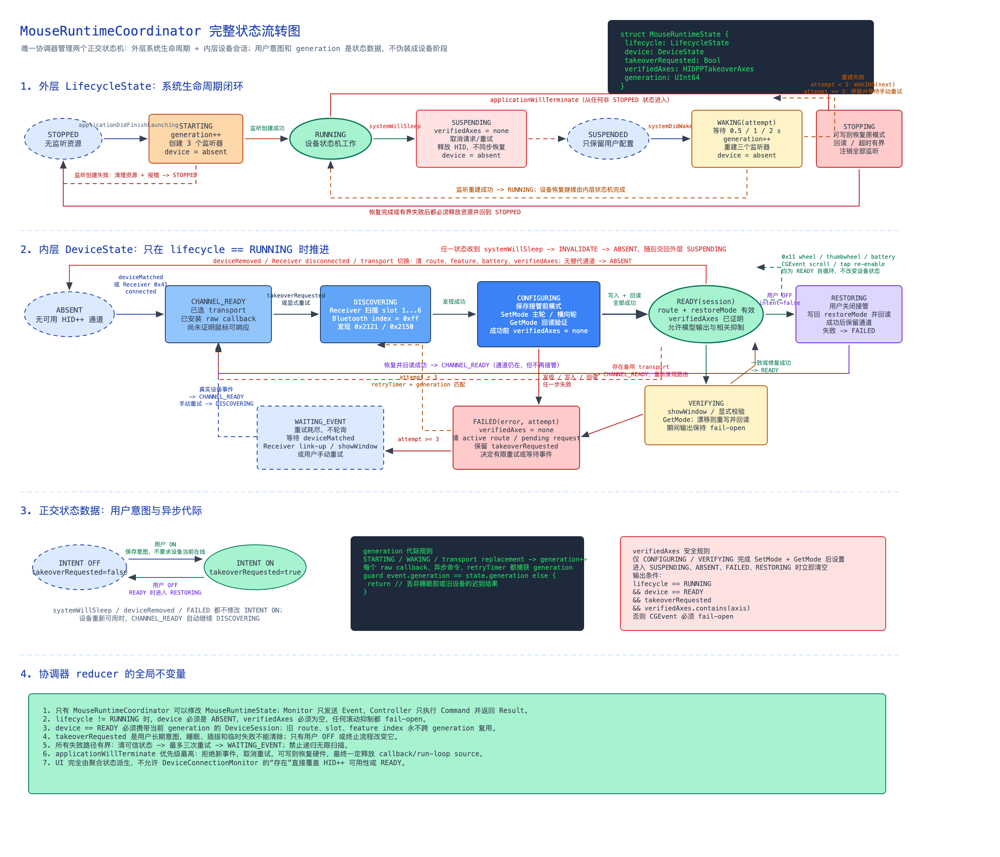
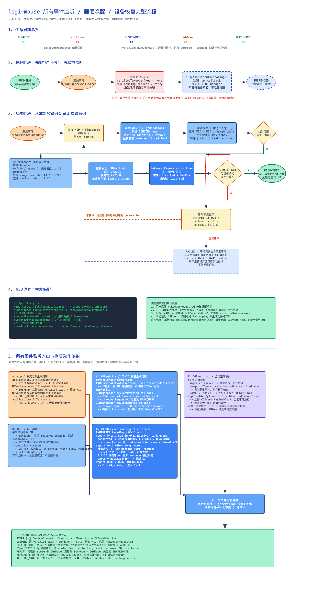

# 鼠标运行时协调器

## 目标

macOS 睡眠时，旧的 `IOHIDManager`、`IOHIDDevice`、回调上下文和 HID++ 路由都可能失效。唤醒后即使旧对象仍然存在，也不能把它们视为可继续使用的硬件会话。

本实现使用一个应用级 `MouseRuntimeCoordinator` 管理睡眠、唤醒、设备插拔、用户开关和应用退出。它不引入新的状态机框架，只使用 Swift 枚举、值类型 reducer 和显式副作用：

```text
系统/UI/设备/定时器事件
          ↓
MouseRuntimeEvent
          ↓
MouseRuntimeReducer（纯状态转换）
          ↓
MouseRuntimeState + MouseRuntimeEffect
          ↓
MouseRuntimeCoordinator 执行命令
          ↓
命令结果重新变成 MouseRuntimeEvent
```

完整状态图：



睡眠唤醒细化图：



## 为什么不引入新框架

当前状态空间有限，且副作用边界已经由 `HIDMonitor`、`CGEventMonitor` 和 `HIDPPController` 明确划分。第三方状态机框架会增加运行时依赖和学习成本，但不会替代 IOKit 对象生命周期、HID++ 串行事务或旧回调失效判断。因此这里采用约 3 个值类型组成的最小实现：`State`、`Event`、`Effect`。

Reducer 不持有 IOKit 对象、不调用硬件、不创建定时器，可以通过输入事件直接做单元测试。协调器是唯一执行副作用并把结果送回 reducer 的位置。

## 四层职责

| 层 | 类型 | 只负责 | 不负责 |
| --- | --- | --- | --- |
| 应用协调层 | `MouseRuntimeCoordinator` | 总状态、事件入口、副作用执行、generation、恢复重试 | HID++ 协议细节 |
| 纯状态层 | `MouseRuntimeState`、`MouseRuntimeReducer` | 确定性状态转换和 Effect 描述 | I/O、回调、定时器 |
| 监听与适配层 | `SystemLifecycleMonitor`、`DeviceConnectionMonitor`、`HIDMonitor`、`CGEventMonitor` | 把系统和设备回调转换为应用事件 | 决定全局生命周期 |
| 硬件事务层 | `HIDPPController` | 串行 HID++ 请求、feature 发现、写后回读、恢复原模式 | 判断应用是否处于睡眠或接受旧会话结果 |

`MouseManagerWindowController` 只订阅协调器，不再创建第二个设备连接监听器。这样 UI、HID++ 和电量显示都来自同一代运行时资源。

## 两组正交状态

运行时状态不是一个把所有情况混在一起的枚举，而是一个聚合状态：

```swift
struct MouseRuntimeState {
    var lifecycle: MouseRuntimeLifecycleState
    var device: MouseRuntimeDeviceState
    var takeoverRequested: Bool
    var verifiedAxes: HIDPPTakeoverAxes
    var generation: UInt64
    var selectedTransport: HIDPPTransport?
}
```

- `lifecycle` 表示进程资源阶段：停止、启动、运行、挂起、睡眠、唤醒、停止中、失败。
- `device` 表示当前硬件会话阶段：不存在、通道就绪、发现能力、配置、校验、恢复、失败、等待设备事件。
- 两者正交。例如应用可以处于 `running`，同时设备为 `absent`；唤醒期间也可能还没有任何 HID interface。

这种设计仍然只有一个权威状态机，只是状态由多个相互独立的维度组成，避免产生“睡眠且蓝牙断开且正在恢复”一类组合枚举爆炸。

## 用户意图与硬件事实

`takeoverRequested` 是用户意图，睡眠和临时断连不会清除它。否则用户每次唤醒都需要重新打开平滑滚动。

`verifiedAxes` 是当前硬件会话的短期事实。只有对应滚轮模式完成“写入 + 回读校验”后才能置为 `true`。发生睡眠、断连、路由变化、校验开始或恢复开始时必须清空。

最终输出门禁为：

```text
lifecycle == running
AND device == ready
AND takeoverRequested == true
AND 对应轴 verified == true
AND 平滑模型和全局输出已开启
```

任意条件不满足，应用都停止注入并放行原生滚动，即 fail-open。不能用“UI 开关为 ON”或“Receiver 仍插在 USB 上”替代硬件校验。

## generation 规则

每一代 HID/事件监听资源都有一个 `generation`。以下操作会先递增 generation，再拆除或重建资源：

- 首次启动；
- 即将睡眠；
- 系统唤醒；
- 应用停止。

监听器注册回调时捕获当前 generation。回调、异步命令结果和重试定时器返回时，reducer 与协调器都会比较 generation；不相等就直接丢弃。

必须“先递增、后拆除”。否则旧 IOHID 回调可能在注销过程中到达，并把已经失效的设备重新标记为 ready。

## 事件流程

### 首次启动

```text
startRequested
→ generation + 1，lifecycle = starting
→ startMonitoring
→ 创建并接线 Connection/HID/CGEvent monitors
→ monitoringStarted
→ lifecycle = running
```

IOHID 在 `start()` 内可能同步发送设备匹配回调，因此 `.starting` 和 `.waking` 阶段允许接收同 generation 的设备回调。

### 系统睡眠

```text
NSWorkspace.willSleep
→ systemWillSleep
→ generation + 1，清空 device / transport / verifiedAxes
→ suspendMonitoring
→ 取消唤醒和接管重试
→ 停止 CGEvent 与设备监听
→ HIDMonitor.suspend()
→ monitoringSuspended
→ lifecycle = suspended
```

睡眠路径不向鼠标写恢复命令。此时无线链路或 USB 栈可能已经停止响应，同步等待 HID++ 超时会延迟系统睡眠。`suspend()` 只作本地失效和资源释放；用户意图仍由协调器保存。

`SystemLifecycleMonitor` 属于控制面，在上述过程中保持存活，确保还能收到 `didWake`。

### 系统唤醒

```text
NSWorkspace.didWake
→ systemDidWake
→ generation + 1，lifecycle = waking(1)
→ 延迟 0.5 秒，等待 IOKit 重新发布设备
→ 重建所有运行时 monitor
→ monitoringStarted，lifecycle = running
→ takeoverRequested ? recoverTakeover(1) : 完成
→ SetMode + GetMode 校验两个滚轮
→ verifiedAxes 完整后恢复输出
```

监听重建失败时按 `0.5s / 1s / 2s` 的节奏最多尝试三次。唤醒后的首次接管失败后再按 `1s / 2s / 3s` 延迟重试三次；达到上限后进入 `waitingForEvent`，只等待 Bluetooth interface 匹配或 Receiver `0x41` 连接通知，不做无限轮询，也绝不由普通主滚轮或拇指滚轮报告触发控制请求。

如果设备事件先完成自动恢复，两轴校验成功会取消尚未触发的接管重试，避免重复硬件事务。

### 设备断开与重新连接

```text
设备断开
→ controllerState(unavailable) / takeoverAxesChanged(none)
→ 清空当前硬件事实，保留 takeoverRequested
→ 立即停止注入并放行原生事件

设备重新连接
→ HIDMonitor 重新选择 channel 和 route
→ HIDPPController 根据保留的请求执行一次事件驱动恢复
→ 写后回读成功
→ controllerState(ready) + takeoverAxesChanged(verified)
→ 恢复输出
```

USB Receiver 的 interface 存在只表示接收器插着，鼠标上线以 Receiver `0x41` 链路事件为准。Bluetooth 使用 interface 到达和移除事件。

### 用户打开或关闭平滑滚动

打开时，先启用模型和 CGEvent 监听，再记录接管意图并执行硬件接管。直接用户操作是事务性的：首次接管失败会把开关和意图恢复为关闭。

关闭时，先停止应用输出，再恢复主滚轮和横向轮的原始模式；只有恢复成功才关闭模型。恢复失败时 UI 保持开启，避免显示状态与硬件状态不一致。

### 应用退出

退出和系统睡眠不是同一条路径：

```text
stopRequested
→ generation + 1，清除 takeoverRequested
→ stopMonitoring(restoringHardware: true)
→ HIDPPController.restoreSynchronously()
→ 注销回调并释放资源
→ monitoringStopped
→ lifecycle = stopped
```

应用退出时设备通常仍可响应，因此应尽力同步恢复原生滚动，防止进程退出后鼠标仍留在 Diverted 模式。

## 关键不变量

1. `MouseRuntimeCoordinator` 是唯一运行时状态所有者。
2. 非 `.running` 阶段不能抑制原生滚动。
3. 睡眠和断连保留用户意图，但清除所有硬件校验证据。
4. 只有 HID++ 写后回读成功才能设置 `verifiedAxes`。
5. 所有异步回调、命令结果和定时器必须携带 generation。
6. 睡眠只失效资源，不等待硬件恢复；应用退出才执行恢复写入。
7. 恢复重试有上限，达到上限后转为设备事件驱动。

## 代码位置

- `Sources/LogiMouse/App/MouseRuntimeCoordinator.swift`：总状态所有者和 Effect 执行器。
- `Sources/LogiMouse/Runtime/MouseRuntimeState.swift`：聚合状态和值语义定义。
- `Sources/LogiMouse/Runtime/MouseRuntimeReducer.swift`：纯事件转换和重试策略。
- `Sources/LogiMouse/Runtime/SystemLifecycleMonitor.swift`：macOS 睡眠/唤醒通知。
- `Sources/LogiMouse/Input/HIDMonitor.swift`：IOHID 回调生命周期和 suspend/stop 区分。
- `Sources/LogiMouse/HIDPP/HIDPPController.swift`：串行硬件事务和模式校验。
- `Tests/LogiMouseTests/App/MouseRuntimeReducerTests.swift`：睡眠、唤醒、旧回调和输出门禁测试。
